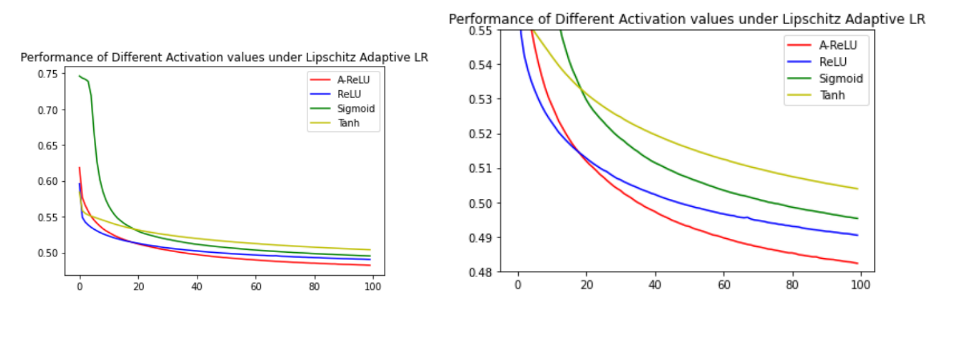

# Parsimonious_Computing_LALR  
This Repo is an implementation of the Research paper - Parsimonious Computing: A Minority Training Regime for Effective Prediction in Large Microarray Expression Data Sets. By - Shailesh Sridhar and Snehanshu Saha  
# Dataset  
The dataset used is GEO (Gene Expression Omnibus) The data set consists of 129,158 gene expression profiles or samples obtained from the Affymetrix microarray platform. Each profile is associated with 22,268 gene probes, Out of which 978 are landmark genes and the remaining 21,290 are target genes whose values are to be predicted.  
# Results 
The results emphasise that using LALR we can reduce one Layer of Neurons and Compute to the same level of Performance, all because of using LALR which results in faster computation and early convergence.  

  
